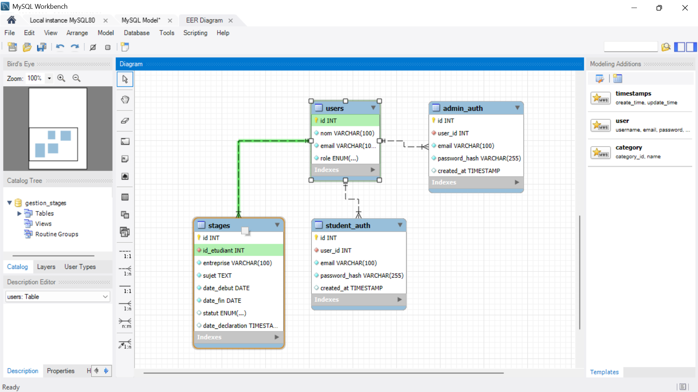

# Gestion des Stages  #
## Guide d’Installation ##

Ce document décrit pas à pas l’installation et l’exécution de
l’application Gestion des Stages (backend Flask + frontend
HTML/JS + base de données MySQL).

Prérequis

Avant de commencer, assurez-vous d’avoir installé les outils suivants :

a\) Python 3.8 ou plus

python --version

python -m pip --version

👉 Si Python n’est pas installé : - Téléchargez-le depuis
https://www.python.org/ - 

⚠ Cochez Add Python to PATH lors de l’installation

Je recommande Python 3.11

b\) MySQL 8.0 ou plus

> ● Télécharger MySQL Installer depuis https://www.mysql.com/ ● Choisir
> Developer Default
>
> ● Notez soigneusement le mot de passe root défini lors de
> l’installation

c\) Git (optionnel) git --version

👉 Téléchargement : https://git-scm.com/


## Étape 1 : Configuration de la Base de Données 

1. Démarrer le service MySQL

>. Ouvrir Services (services.msc) ● Démarrer MySQL (ou MySQL)


2. Prendre le fichier data_base.sql puis runner la commande



## Étape 2 : Configuration du Backend (Flask) 

cd C:\gestion-stages\backend

python -m venv venv 

venv\Scripts\activate

Installation des dépendances

pip install -r requirements.txt


⚠ Remplacez **password123@**par votre mot de passe MySQL réel

Fichier principal

> ● Créez app.py

## Étape 3 : Vérification de la partie backend du code

[<u>app.py</u>](http://app.py) :

. . .

DB_CONFIG = {

> 'host': os.getenv('DB_HOST', 'localhost'),
>
> 'user': os.getenv('DB_USER', 'root'),
>
> 'password': os.getenv('DB_PASSWORD', 'votre mot de passe MySQL réel'),
>
> 'database': os.getenv('DB_NAME', 'gestion_stages'),
>
> 'port': int(os.getenv('DB_PORT', 3306)),

}

. . .

## Étape 4 : Lancer l’Application :

Terminal  – Backend

cd C:\gestion-stages\backend venv\Scripts\activate

python app.py

➡ Flask sert automatiquement le frontend

## Étape 5 : Accès à l’Application

Ouvrir le navigateur :

👉 http://localhost:5000

🔧 Tests de Connexion

Test 1 – Compte étudiant

> ● Email : jean.dupont@email.com ●

> Mot de passe : bonjour123

Test 2 – Compte administrateur 

> ● Email : admin@ecole.fr

> ● Mot de passe : simo123

## 📁 Structure du Projet

```text
gestion-stages/
├── backend/
│   ├── venv/              # Environnement virtuel Python
│   ├── logs/              # Fichiers de logs de l'application
│   ├── app.py             # Point d'entrée de l'API backend
│   ├── requirements.txt   # Dépendances Python
│   ├── test.py   # Fichier pour teester la connexion avec mysql et la database :"gestion_stages"
└── frontend/
    ├── components/
    │   ├── api.js         # Fonctions d'appel à l'API backend
    │   └── auth.js        # Gestion de l'authentification
    ├── index.html         # Page d'accueil / connexion
    ├── student.html       # Interface étudiante
    ├── admin.html         # Interface administrateur
    ├── script.js          # Script commun
    ├── student.js         # Logique spécifique étudiant
    ├── admin.js           # Logique spécifique administrateur
    └── styles.css         # Styles CSS communs
```


🔄 CommandesUtiles

cd C:\gestion-stages\backend

venv\Scripts\activate

python app.py

Quitter l’environnement virtuel :

deactivate


## 🎥 Vidéo de démonstration du projet

Une vidéo illustrant la réalisation complète et le fonctionnement de l’application Gestion des Stages (backend Flask, frontend HTML/JS et base de données MySQL) est disponible via Google Drive.

Et une autre vidéo qui explique comment créer un environnement virtuel dans le dossier du backend.

👉 Lien Google Drive :
🔗 https://drive.google.com/drive/folders/1ef44SMkJFzQC4DUocbN1d5ZdqBqQUTVq

📌 Cette vidéo présente notamment :

La configuration de la base de données MySQL

Le lancement du backend Flask

L’interface de connexion (étudiant / administrateur)

Les principales fonctionnalités de l’application


